# InkTeach · Windows 课堂批注

[中文](README.md) | [English](README.en.md)

**一层透明覆盖层：在 PPT / WPS / 任意软件上直接写板书。**
它不是"又一个白板"，是一块**贴在别人软件上面的板书层**——板书写在自己的图层里，
底下那个 PPT 一点没动，点一下就把鼠标还给 PPT。

[](https://github.com/XueRenYi0/InkTeach/releases/latest)
[](LICENSE)

[](https://github.com/XueRenYi0/InkTeach/releases)

**下载**：[GitHub Releases](https://github.com/XueRenYi0/InkTeach/releases/latest)（`InkTeach-Setup-<版本>.exe` 双击下一步，
或绿色版 `InkTeach-<版本>-win-x64.zip` 解压即用）｜[GitCode 国内镜像](https://gitcode.com/XueRenYI0/InkTeach/releases)
｜**官网**：<https://xuerenyi0.github.io/InkTeach/>

<p align="center"></p>

---

## 特色：这几个地方，市面上的批注软件基本没做

### ① 色带——平时是一条 6 像素的线，用的时候才长成设置条

工具选中以后，它头顶那条**设置条不是一直摊着的**，而是压成 **6 像素**的一条色线；
鼠标碰到它，用 120ms 张开到 **34 像素**的完整设置条（色板 / 线型 / 粗细 / 档位…），
移开之后等 **450ms** 才收——"快出慢隐"，是 Windows 任务栏自动隐藏那一套手感。

**压成线以后仍然可以直接点**：12 个色片压成 6 像素还是能点，不用先展开再选
（挑颜色是最高频动作，逼着人"两步"就等于不好用）。

<p align="center">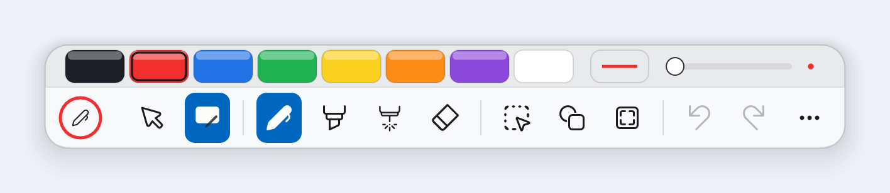</p>

<p align="center"></p>

### ② 贴边隐藏——藏起来只剩一条 48 像素的把手

把工具带拖到屏幕底边，它会**缩到只剩一条把手**（长 48、厚 8，颜色就是当前笔色）。
48 这个长度是有理由的：仓库里另一条规矩写着"48 是点得到的最小东西，触摸屏上也够"，
而**藏起来的时候恰恰是最需要一次点中的时候**——教室里没键盘，工具找不到是真问题。

贴边判定用的是"离屏幕底 ≤10 像素"，**不是**离任务栏上沿——所以默认位置不会误触发，
要收起来必须**明确把面板拖到最底下**，这个手感是量出来的不是猜的。

<p align="center">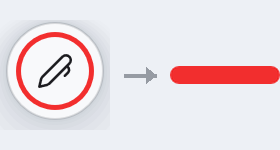</p>

### ③ 呼出盘——按住一个全局键，划向扇区，松手切

`Ctrl+Alt+Shift+Q`（**全局键，任何程序在前台都生效**）：按住不放，光标处浮出八扇面，
划向要的工具或颜色，**松手执行**。八扇区 = 笔 / 黑 / 红 / 蓝 / 橡皮 / 框选 / 荧光笔 / 激光。

- 熟手不用等盘：出盘有 120ms 延迟，直接划走盘根本不闪。
- **开着穿透也能按**——它是"把笔从下层抢回来"的入口：选一个扇区就退出穿透并切到它，
  想继续用下面的程序就把鼠标松在盘心（只是取消，穿透不动）。
- 它不新增任何命令：扇区里的动作和工具键走**完全同一条路**，不会两套逻辑跑偏。

<p align="center"></p>

### ④ 穿透 + 全局键：能"过手"，也能"抢回来"

点一下「鼠标」那格（或全局 `Ctrl+Alt+Shift+T`）鼠标就还给下层程序，可以正常去点 PPT。
这时候想写字，**不用去找工具带**——全局键直接把人拉回来：呼出盘换工具、
穿透开关退出、退出程序同理。三条全局键统一是 `Ctrl+Alt+Shift+…` 三层修饰，
就是为了不和别的软件撞车。

### ⑤ 停顿成图形：手写一笔，停住 0.4 秒，它自己变规整

手写一个歪圆，笔尖停住约 400ms，它变成一个**规整的圆**；按住还能拖到位再松手。
直线、矩形、三角形、平行四边形同理。吸附和"用图形工具画直线"是同一套
（特殊角软吸附 ±1°、`Shift` 15° 硬网格、`Alt` 自由）。

### ⑥ 22 种图形与学科工具

直线 / 箭头 / 矩形 / 椭圆 / 圆 / 三角形 / 平行四边形 / 坐标系；
抛物线 / 双曲线 / 正弦 / 余弦 / 波浪线 / 正切；圆柱 / 圆锥 / 圆台 / 球 / 棱柱 / 棱锥 / 棱台。

**每个定义元素都是可以直接拖的手柄**（端点、半轴、顶点、焦点、渐近线…），
拖的时候有特殊形状吸附（正方形、正圆、姿态角），并实时显示角度 / 半径 / 长度读数。

<p align="center">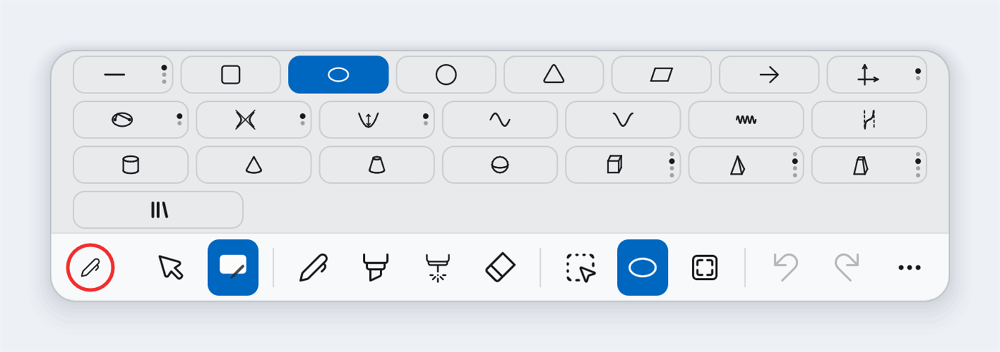</p>

<p align="center">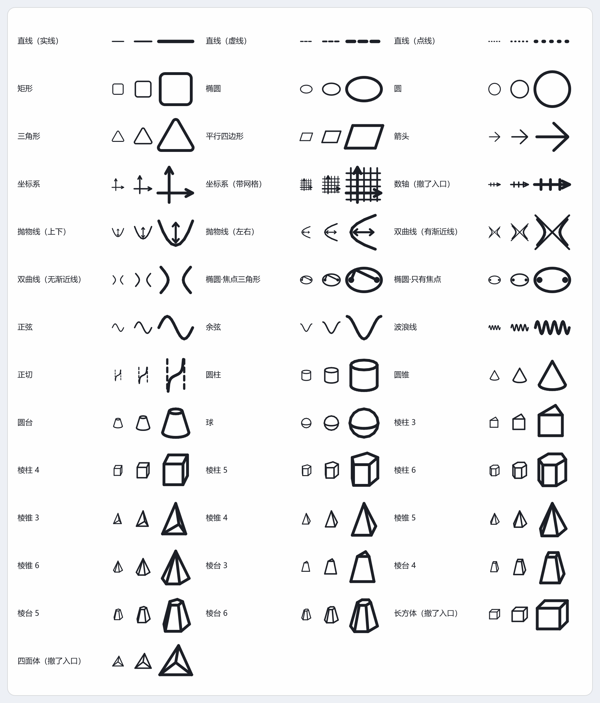</p>

<p align="center">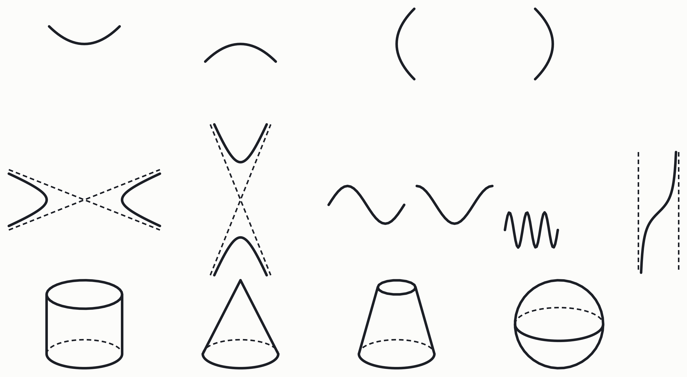</p>

### ⑦ PPT 逐页隔离：翻页只看这一页，每页都记得

进放映自动进入、退出自动回桌面页。**每一页的墨迹完全隔离**，页内还能滚动、
每页记住滚到哪；自动存 / 自动读，支持**回放本页墨迹**（把这一页的书写过程重放一遍）。
连不上 PowerPoint / WPS 时**零症状**——不联动而已，不报错、不卡、不弹窗。

### ⑧ 深色主题：不是"把颜色反过来"，是整套一起重调

深色档覆盖工具带、浮动面板、悬停提示、PPT 控件条和课堂窗。深浅两套是**分别调过的**：
浅色靠"底沿一道暗边"读出厚度，深色靠"顶沿一道高光"读接光——把深色那套直接反相，
层次感会整个塌掉。

<p align="center"></p>

<p align="center"></p>

<p align="center">
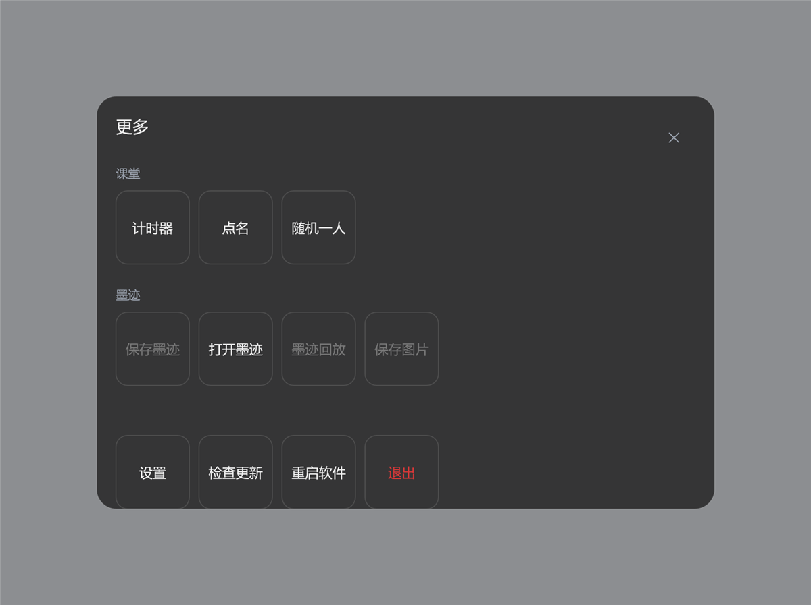
&nbsp;&nbsp;
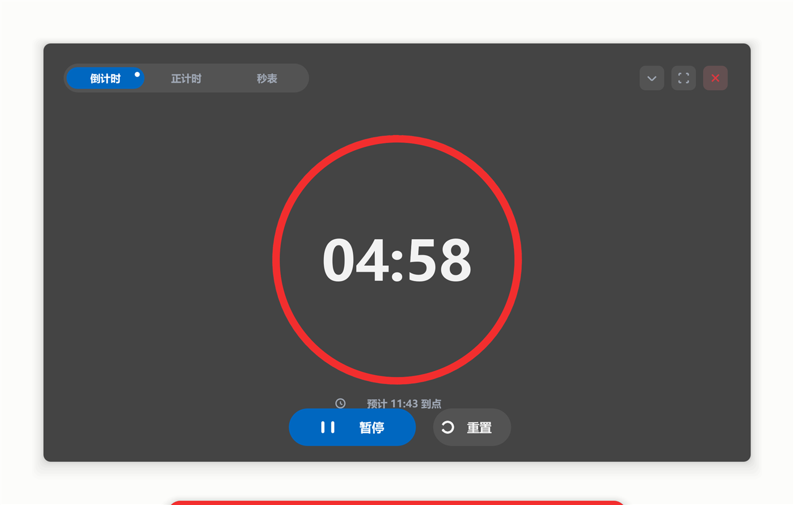
</p>

---

## 界面

### 一条能收纳的工具带

平时是一条贴在屏幕底边的胶囊工具带；**上带跟着当前工具长出"设置条"**——
笔 = 色板 + 线型 + 粗细、图形 = 22 段、橡皮 = 大小、白板 = 板色 + 底纹、截图 = 两种截法。

工具带可以拖到任意位置、贴底自动收纳；档位有「极简 / 完整」两档（极简只留
`[鼠标][白板][笔][橡皮][后撤][更多]` 六格，两档顺序自动保持一致）；右键可以取消 / 恢复钉住；
鼠标悬停约 0.5 秒（触摸长按 0.6 秒）浮出"名称 + 快捷键 + 说明"。

### 书写

- **压感**口径对齐 WPF / Windows Ink：`宽度 = 档位宽 × clamp(2.0 × 压力, 0.10, 2.0)`
  （半压 = 1.0 倍、满压 = 2.0 倍），渲染走 Direct2D 原生墨迹 `ID2D1Ink`（逐点半径变宽）；
  鼠标 / 无压感设备回退等宽。
- **跟手**：每帧先等"上一帧已经上屏"再抽消息再提交（把「Present 返回 → 屏幕变色」
  从 3.5 个刷新周期压到 **1.0** 个）；真笔书写时笔迹交给系统合成器画（湿墨），
  书写期间开 GC 低延迟档，一笔期间自检断言无第 2 代回收。
- **两种橡皮**：整笔擦（碰到哪条删哪条）和面积擦（只擦碰到的一块，一笔切成两段）；
  面积擦的尺寸跟随手速（慢速不缩、快扫封顶 2.5 倍），"看见的框 = 擦的范围"。

### 选中与编辑

点选（点墨迹直接选中，`Shift` 加选 / `Alt` 减选）、矩形框选（碰到就选）、套索
（代表点 80% 在圈里）。选中框 = 8 个手柄 + 旋转柄：旋转有 90° 软吸附（`Shift` 15° 硬网格、
`Alt` 自由）；**小对象自动改用"最小操作框"**，手柄不压住内容、缩放锚点钉在对象自己的对角。

操作条十格：**收起 / 颜色 / 锁定 / 层级 / 导出 / 图库 / 复制 / 左右翻转 / 上下翻转 / 删除**。
颜色面板里有连续粗细滑条（拖动实时显示数值、松手一步撤销）、三档线型、4×4 色板 + HSV 取色。
复制支持"拖出副本"模式；**拖动 / 旋转期间模型一个字不改**，内容层一帧不重画
（预览画在浮动层，松手才提交，一步撤销）。

<p align="center">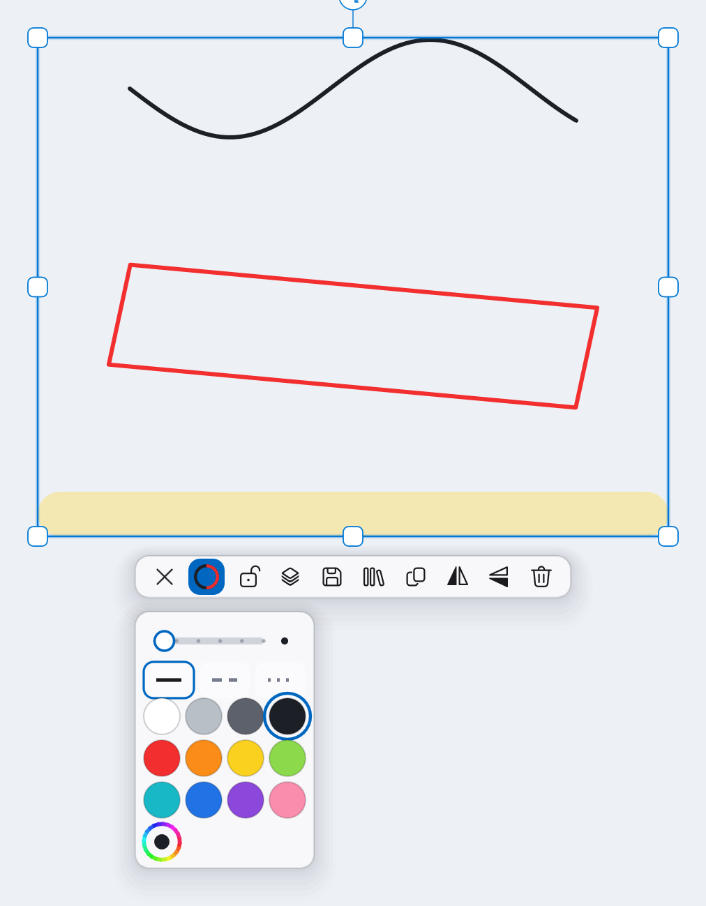</p>

### 截图 · 导出 · 剪贴板

- **截图**：按下即冻结整屏 → 拖框取景（遮罩挖洞 + 准线 + 尺寸读数）→ 松开进调整
  （8 手柄 / 方向键微调）→ **原位落** + 自动选中 + 进剪贴板。两种截法：
  「连批注一起」和「隐藏窗口截图」（拍到的只有下层内容）。
- **导出**：选中的对象导成透明 PNG / 白底 PNG / JPEG / BMP；「更多 → 保存图片」
  把整块板书存成图片。
- **剪贴板对象通道**：`Ctrl+C` 在同一次剪贴板会话里同时放对象字节和一张透明 PNG——
  粘回批注里仍是**可编辑对象**，粘到 Word / PPT / 微信里是一张图。

<p align="center">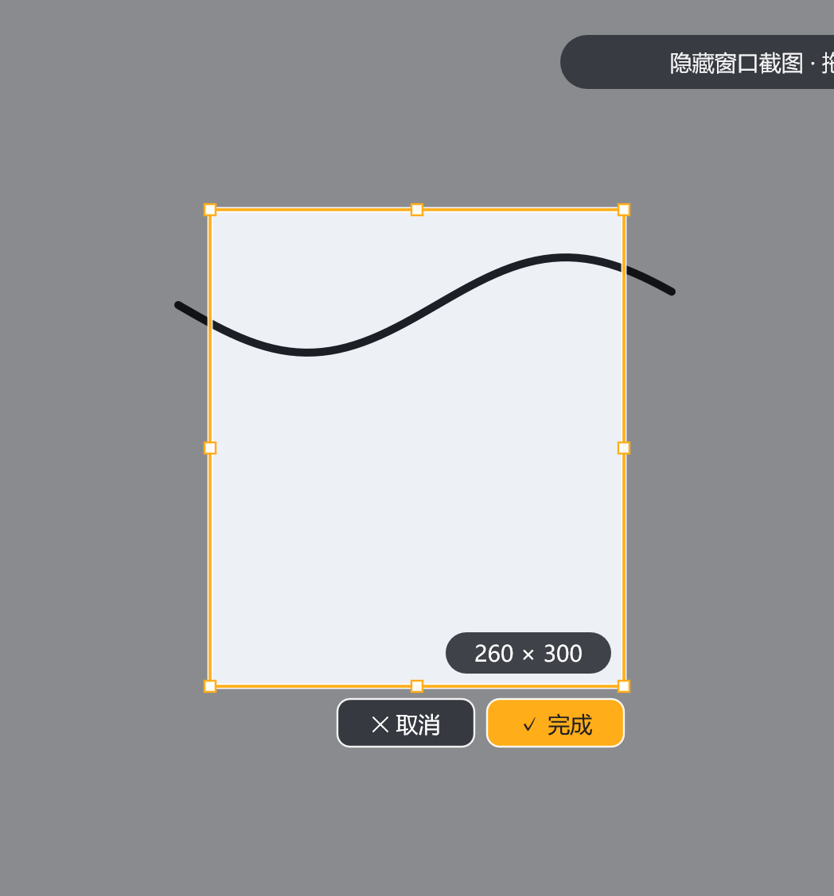</p>

### 白板 · 课堂工具

- **白板**：一层遮罩（白 / 绿 / 黑三色 + 方格 / 横线底纹）；切回 PPT 时板书还在。
- **计时器 / 随机点名**：两个独立居中窗，**和工具带同一套视觉语言**，
  深浅两套主题都有。计时器三种模式各自独立计时（切页签不打断、到点响），可缩成
  320×150 的小挂钟，也能真全屏；到点时**数字和进度环一起变红**，投影上远处一眼就看见。
  点名抽过不重复（抽完自动重置），名单写在 `%APPDATA%\InkTeach\Names.txt`，
  没名单时可以直接抽学号 `1–N`。

<p align="center">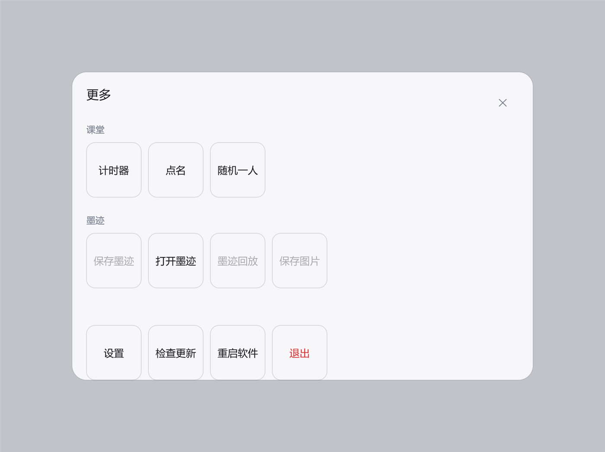</p>

<p align="center">
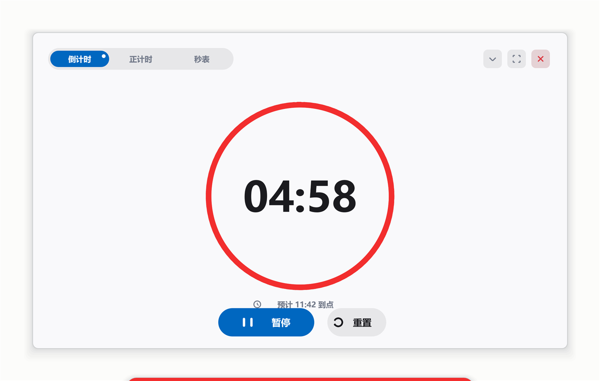
&nbsp;&nbsp;

</p>

<p align="center">
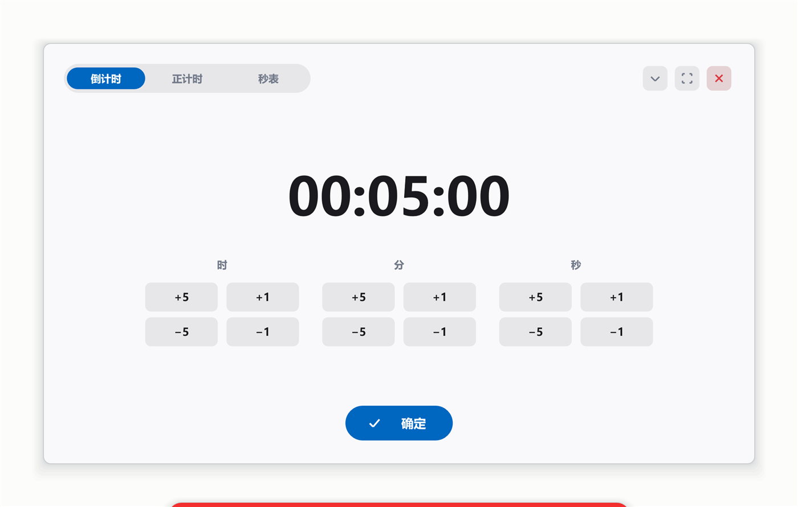
&nbsp;&nbsp;

&nbsp;&nbsp;
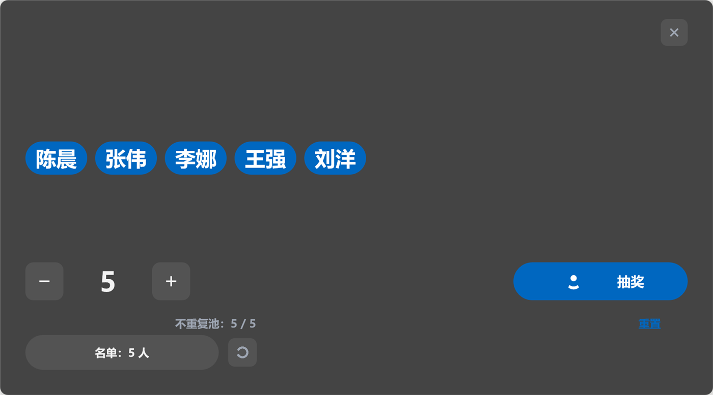
</p>

> 课堂窗的进度环**跟着你当前的笔色走**——笔是红的就是红环，换支蓝笔就变蓝环。
> 唯一的安全阀：笔色和面板底对比度不足 3:1 时（比如白笔配浅色面板）自动退回强调色，
> 免得"看不见时间"。

---

## 为什么是 Direct2D ＋ .NET 10

常被问的一句："批注软件用 D2D，是不是大炮打蚊子？"
不是。我们不是为了画动画选它，是因为有三件事**只有它这一条路能做**，而且都不是渲染特效。

### 为什么是 D2D / DirectComposition

**① 笔迹交给系统合成器画，CPU 只送点。**
有压感时走 D2D 原生墨迹 `ID2D1Ink`（逐点半径变宽）；真笔书写那一段的"湿墨"直接
委托 Windows 的 Inking 引擎（DwmInk 轨迹）去画，**不是我们模拟出来的**。
这一条的意义不是"我们延迟更低"——延迟谁都能吹——而是**湿墨这种效果不需要我们去追**：
它是系统给的，我们只负责把点按时送到。

**② 三层共用一条管线，各自按脏区增量出帧。**
板书内容层、覆盖层界面、PPT 联动控件条是三个独立的合成目标。内容层在画布空间**分块**
（`CanvasTiles`）+ 脏矩形增量修补——落笔只重画那一小块；**拖动一万条选中的内容时，
内容层一帧重画 0 块**，预览画在浮动层，松手才落模型。

**③ 界面全部自绘，没有一个第三方 UI 控件。**
圆角、投影、悬停、色带、分段、名牌全是我们的几何。好处很具体：
**深色主题、200% DPI、投影仪偏色，都是改 `src/InkUi/Tokens.cs` 一个文件的事**——
不用和某个框架的主题系统打架，也不用迁就它的行为。

**代价也说实话**：自绘没有设计器，靠"单点收口 + 离屏出图"代替——
`--panelshow` 能把任意一格、任意一页面板离屏渲染成图当设计稿看。

### 渲染管线的底层细节（2026-10 这一版补的）

这一版没有加新功能，专门把"脏区 / 相机 / 分块缓存"这几条底层路径对着几个成熟上游
逐条过了一遍——**Xournal++ 的分块与预取、Rnote 的视口余量、MyPaint 的 tile 分区纪律、
Excalidraw 的相机处理、Windows Terminal 的后缓冲不变量**。能直接对齐上游稳定做法的，
就直接对齐，不重新发明：

| 细节 | 做法 |
|---|---|
| **画布空间分块缓存** | 内容层按 **256 像素一块**烘进缓存（块原点对齐画布像素，拼接无缝）；预算内常驻，超预算按 LRU 淘汰 |
| **脏矩形 + 部分上屏** | 每帧只提交最少的脏矩形（`Present1`）；滚动条这类常驻元素的脏区按**可见性门控**——不可见就不进脏区，否则"滚动条 ∪ 笔迹"的并集会把别的列扫出屏幕 |
| **双缓冲一致性** | 相机变化（滚动 / 缩放）之后**连续两帧整屏重铺**，保证两个后缓冲都是新相机——借的是 Windows Terminal 那条"后缓冲不变量"纪律 |
| **视口外预取** | 视口外一圈的分块在空闲帧提前烘好（每帧限量、有预算，`--noprefetch` 可关）——滚到新区域没有"补课"卡顿（Xournal++ 预载 / Rnote 视口余量） |
| **相机取整** | 相机平移按设备像素取整：静态内容在原位重画，不会再因为亚像素抖动"糊一下" |
| **拖动零重画** | 拖动 / 旋转一万条选中内容时，内容层 **0 块/帧**重画：预览画在浮动层，松手才提交（一步撤销） |
| **撤销保序** | "清空"的撤销是**按原位置插回**每条墨迹，撤销后文档与清空前逐字节一致，不靠"追加" |

每一条都在自检里挂着开关和量化数字（`--prefetchtest` / `--scrollflash` / `--longrun` …），
不是"感觉快了"。

### 为什么是 .NET 10（而不是 C++ / WPF / WinUI3）

| 理由 | 具体是什么 |
|---|---|
| **教室机能装** | 自包含发布，绿色版解压即用：**不弹 UAC、不装 .NET、拷 U 盘就能用**（v8.9.0 起默认 NativeAOT：单 exe 约 11MB、zip 不到 5MB）。学校机器往往锁着安装权限，装不上等于用不了 |
| **不背 UI 框架** | 我们要的是"一块透明覆盖层 + 逐帧增量出帧"，WPF/WinUI 的合成与主题行为在这里全是负担（WinUI 的 Mica/亚克力在投影仪上掉帧，我们明确不做毛玻璃） |
| **AOT 已经跑通并成为默认** | "自绘 UI + P/Invoke + Vortice"恰好是**少数能走 Native AOT 的 Windows 桌面栈之一**——WPF / WinForms / WinUI3 官方就不支持 trimming / AOT。v8.9.0 起默认发 AOT：冷启动 747→642ms、绿色包从 74MB 目录缩到 11.1MB 单 exe（JIT 自包含版用 `publish.ps1 -Jit` 保留） |
| **GC 我们自己管** | 书写期间切 `SustainedLowLatency`，自检断言**一笔全程不发生第 2 代回收**——这是靠"能控制 GC 模式"换来的 |

**已知短板**（不想吹过头）：
- ~~Native AOT~~：**已上并成为默认**（v8.9.0。`PptLink` 的 `dynamic` 已重写为裸
  vtable + IDispatch；Vortice 3.8.3 本身已标注 AOT 兼容）。JIT 自包含版用 `-Jit` 保留；
- ~~.NET 10 升级~~：**已完成**（.NET 8 的安全更新 2026-11-10 到期；v8.9.0 起是
  .NET 10，支持到 2028-11）；
- **内存不便宜**：空载提交 92.6MB（AOT 版 88.4MB；一万笔约 388MB），其中 .NET 运行时 +
  程序集约 28MB（AOT 约 12MB）、D3D/D2D 设备与交换链约 42MB、其余是我们的代码和数据。

### 实测数字（本机 2 倍屏 / Iris Xe，测试方法与环境见文末文档）

| 项目 | 数字 |
|---|---|
| Present 返回 → 屏幕变色 | **1.0 个刷新周期**（未配速时 3.5） |
| 拖动一万条选中的内容 | 内容层 **0 块/帧**重画；每帧记录平均 2.7ms / 最长 5.5ms |
| 空闲帧 | **0**（界面"有东西动才画"） |
| 面板 / 动画帧 | 约 0.5 ～ 1.5 ms |
| 冷启动（窗口可见） | **267 ms**（同机空白 WPF 窗 402 ms） |
| 一万笔整层重铺 | 约 190 ms（压力基准） |
| 书写期间 GC | `SustainedLowLatency`，一笔全程保持，自检断言无第 2 代回收 |
| 内存（空载 / 一万笔） | 提交 93 MB / 392 MB |

---

## 下载与安装

1. **安装包（推荐）**：`InkTeach-Setup-<版本>.exe` —— 双击 → 下一步 → 完事。
   **不弹 UAC**：装到 `%LOCALAPPDATA%\Programs\InkTeach`（只给当前用户），
   自动更新因此才能无感换壳。批量部署可静默安装：
   ```powershell
   .\InkTeach-Setup-<版本>.exe /VERYSILENT /SUPPRESSMSGBOXES /NORESTART
   ```
2. **绿色版**：解压 `InkTeach-<版本>-win-x64.zip`，双击 `InkTeach.exe`。
   拷给别人时只拷软件目录，不要把开发机的 `%APPDATA%\InkTeach` 一起带过去。

**系统要求**：Windows 10 / 11，64 位。**不需要安装 .NET**（运行时随包发布）。
PPT 联动需要机器上装有 PowerPoint 或 WPS；没装也能正常批注，只是不联动。

**数据全在本机**：设置在 `%APPDATA%\InkTeach`，自动存档在 `%LOCALAPPDATA%\InkTeach`，
点名名单是 `%APPDATA%\InkTeach\Names.txt`。更新检查**只在点它时联网**，
下载包先校验 sha256 再换壳安装，对不上直接拒绝。

## 快捷键（摘要）

| 作用域 | 键 |
|---|---|
| 全局（任何程序在前台） | `Ctrl+Alt+Shift+T` 穿透 ｜ `Ctrl+Alt+Shift+X` 退出 ｜ `Ctrl+Alt+Shift+Q` 呼出盘（按住划向扇区；**穿透中也能用**，选扇区即退出穿透） |
| 批注内（默认键盘归批注层） | `Ctrl+P` 笔 ｜ `Ctrl+I` 荧光笔 ｜ `Ctrl+L` 激光笔 ｜ `Ctrl+E` 橡皮 ｜ `Ctrl+M` 选中 ｜ `Ctrl+S` 截图 |
| 编辑 | `Ctrl+Z / Y`（重做也有 `Ctrl+Shift+Z`）撤销 / 重做 ｜ `Ctrl+A` 全选 ｜ `Ctrl+C / V` 复制 / 粘贴 ｜ `Delete` 删除 ｜ `Esc` 取消 ｜ 方向键微调（`Shift` ×10；**没选中时 ←→ 翻屏、↑↓ 滚画布**）｜ `Ctrl+= / Ctrl+-` 放大 / 缩小选中（连按合并成一步撤销） |
| 其他 | `Ctrl+6` 换粗细 ｜ `Ctrl+B` 开 / 关白板 ｜ `Ctrl+Shift+C` 清空 ｜ `PageUp / PageDown` 翻屏 |

同一个工具键再按一次 = 只有笔 / 荧光笔换颜色；橡皮（整笔 / 面积）、框选（矩形 / 套索）的子类型在面板上带里选。
放映 PPT/WPS 时工具键会自动临时升级成全局热键，翻页用 `←→`、滚画布用 `↑↓`（滚轮保留"页内滚动"）。
连续微调 / 缩放会合并成一步撤销（停手或做别的事才封口）。
完整键表、修改记录与冲突实测见 [快捷键总表.md](快捷键总表.md)。

## 从源码构建与自检

```powershell
# 交互模式（需要 .NET 10 SDK）
dotnet run --project src/InkTeach -c Release

# 键位自检（含"文档与键位表是否一致"）
dotnet run --project src/InkTeach -c Release -- --keytest

# 渲染验证 + 一万笔压力基准
dotnet run --project src/InkTeach -c Release -- --selftest 8

# 功能套件（逐条红绿）与性能套件（只看数字）
pwsh -File tools/bench/Run-FuncSuite.ps1
pwsh -File tools/bench/Run-PerfSuite.ps1
```

这套自检不靠肉眼：合成输入 + 截屏数像素，覆盖输入链路、橡皮、选中、截图、PPT、
计时点名、导出、自动更新等 60+ 个开关；**每个数字都有断言**，FAIL 时退出码为 1。
完整清单见 [开发笔记.md](开发笔记.md) 的「自动化测试」一节。

## 架构

```
InkTeach   宿主：命令行 / 自检 / 基准（发布版双击 InkTeach.exe）
  ├ InkUi      产品界面：球 ↔ 工具带、中央「更多」面板、课堂窗（全自绘）
  └ InkEngine  引擎：文档模型 · 输入 · 渲染 · 命中 · 存档 · Win32
               唯一契约：IOverlayUi · IUiHost · IEngineCommands
```

- **窗口**：无边框、置顶、不抢焦点、不进任务栏的透明覆盖层；穿透用命中测试豁免
  （`WM_NCHITTEST → HTTRANSPARENT`）把鼠标还给下层。
- **输入**：`WM_POINTER` 统一处理笔 / 触摸 / 鼠标；真笔的"湿墨"委托给系统合成器；
  触摸有"第二根手指不许抢走正在写的那一笔"守卫。
- **命中**：均匀网格空间索引，从 O(笔画数) 降到 O(邻近格子)（实测快 32 倍）。
- **引擎 / 界面分离**：界面只认 `IOverlayUi` / `IUiHost` / `IEngineCommands` 三个契约，
  整个换掉界面不影响引擎（现在挂的是 `src/InkUi`）。

## 文档

| 文档 | 内容 |
|---|---|
| [快捷键总表.md](快捷键总表.md) | **快捷键唯一权威来源**：每一条绑定、作用域、修改记录、注册冲突实测 |
| [开发笔记.md](开发笔记.md) | 踩坑记录、实测数据、自检清单、发布与自动更新细节 |
| [架构-分层与规则.md](架构-分层与规则.md) | 分层、单源纪律、自检规矩 |
| [引擎边界-多界面接入规范.md](引擎边界-多界面接入规范.md) | 引擎 / 界面三个契约的边界 |
| [底层设计-笔迹对象模型.md](底层设计-笔迹对象模型.md) | 笔迹 / 图形 / 图像对象模型 |
| [对标-微软墨迹栈与我们的架构.md](对标-微软墨迹栈与我们的架构.md) | 与 WPF / UWP Ink 的能力对照 |
| [延时-实测与优化.md](延时-实测与优化.md) | 端到端延时的分场景实测与优化依据 |
| [性能-内存与卡顿实测.md](性能-内存与卡顿实测.md) | 内存口径与卡顿归因 |
| [调研-启动内存与WPF对比.md](调研/调研-启动内存与WPF对比.md) | 启动内存基线、Native AOT 评估 |
| [计划-图形工具.md](计划-图形工具.md) | 22 种图形与停顿成型的规格 |
| [调研-选中工具.md](调研/调研-选中工具.md) | 选中框 / 手柄 / 操作条的设计与同行对照 |
| [调研-截图模式-优化.md](调研/调研-截图模式-优化.md) | 截图模式的交互与实现 |
| [清单-软件完善.md](清单-软件完善.md) | 已知缺口与优先级盘点 |

## 许可

**Copyright (C) 2026 XueRenYi0**。本项目采用 **GPL-3.0**（见 [LICENSE](LICENSE)）：
可自由使用、修改、分发（包括商用），衍生项目需按 GPL-3.0 开源并保留出处与许可声明。
需要**闭源商用 / 嵌入自有产品**的，可联系作者谈**商业授权**（版权归作者一人所有，具备双许可条件）。

参考过思路但未复制代码的项目（Ink Canvas / Inkeys / perfect-freehand / $P 等）的出处与许可，
见 [src/InkEngine/THIRD-PARTY-NOTICES.md](src/InkEngine/THIRD-PARTY-NOTICES.md)。
